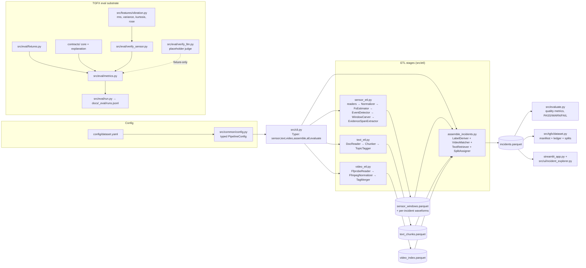
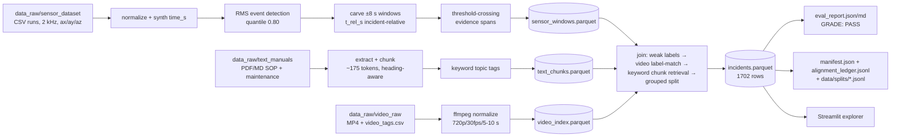
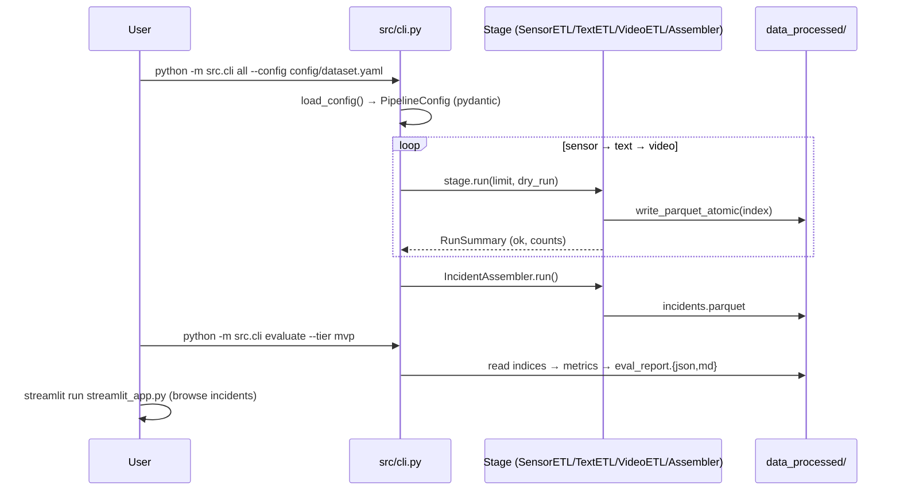
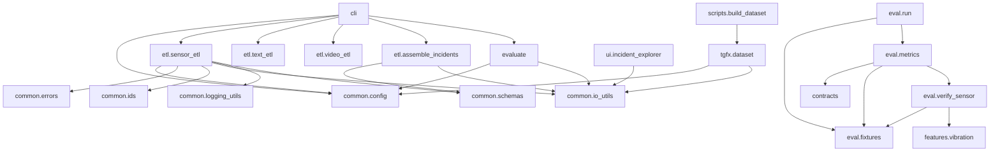

# 03 — Current Architecture Map

All elements below exist in code (paths cited). Nothing is invented; dashed
notes call out declared-but-unimplemented aspects.

## 1. Component diagram

## 2. Data flow diagram

## 3. Runtime flow diagram

## 4. Module dependency map

Notable: `src/eval/` and `contracts/` do **not** depend on `src/etl/` — the TGFX
eval substrate is decoupled from the dataset pipeline and currently connects
only through hand-authored fixtures, not real pipeline outputs.

## 5. Storage / data model map

| Store | Format | Row model | Producer |
|---|---|---|---|
| `sensor_windows.parquet` | parquet index | `SensorWindowRow` | sensor_etl |
| `sensor_windows/*.parquet` | per-incident waveforms | time_s, t_rel_s, ax, ay, az | sensor_etl |
| `text_chunks.parquet` | parquet | `TextChunkRow` | text_etl |
| `video_index.parquet` | parquet | `VideoIndexRow` | video_etl |
| `incidents.parquet` | parquet (JSON-string list cols) | `IncidentRow` | assemble |
| `docs/_data/manifest.json` | JSON | ad-hoc dict + sha256s | tgfx.dataset |
| `docs/_data/alignment_ledger.jsonl` | JSONL | alignment record | tgfx.dataset |
| `data/splits/*.jsonl` | JSONL id manifests | {incident_id, failure_family, source_dataset} | tgfx.dataset |
| `docs/_eval/runs.jsonl` | JSONL | run record (git_sha, seed, metrics, gates) | eval.run |

## 6. API / interface map

- CLI: Typer app (6 commands), exit codes 0/1/2. (`src/cli.py`)
- Python API: `evaluate_build(cfg, tier, write)`, `build_dataset(...)`,
  `compute_metrics(outputs, gold)`, `load_fixture(name)`.
- UI: Streamlit single-page explorer. No HTTP API exists.
- **No model-serving, retrieval, or inference interfaces exist.**
