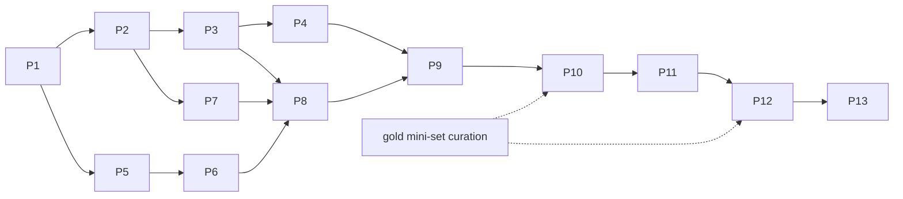

# 01 — Phase Roadmap

Full rationale in `docs/architecture_audit/13_recommended_build_roadmap.md`.
Each phase ends with a user review gate (`04_user_review_gates.md`) and a
rubric score (`05_rubric.md`). Effort: S/M/L (+R/P = research risk).

| Phase | Title | Key deliverables | Exit test (must pass) | Effort |
|---|---|---|---|---|
| 1 | Runnable baseline hardening | Fresh-clone bootstrap (bundled/generated sample data), coverage re-measured, runbook, `.env.example` | `pytest -q` green; documented fresh-clone smoke passes | S |
| 2 | Windowing convention + sensor evidence IDs | Decision-log entry resolving ±8s / 12s / -12..0s conflict (audit R-4); alarm-anchored query window; `SW_*` evidence IDs | window unit tests; ETL rebuild grades PASS | S–M |
| 3 | Patch creation + spectral features | `spectral_bands()` (4 bands) in the one feature path; ETL RMS refactored to import it (I-3); patcher; heuristic anomaly score + important interval | feature agreement meta-test; `SensorWindow` contract instances validate | M |
| 4 | Pluggable sensor encoder | `src/encoder/` abstraction; deterministic baseline encoder → Hvib + anomaly_score; optional PatchTST config; torch dep introduced; seeded training/inference split | shape+determinism tests; val anomaly AUROC ≥ heuristic baseline (run record) | L |
| 5 | SOP embeddings + vector store | Embedding interface (BGE per `SOPChunk`); local vector store; metadata tags; citation format | round-trip persist/search tests; recall@K on seeded queries | M |
| 6 | Evidence graph + retriever | Node/edge schema + store; `retrieve(sensor+video context)`; ranking; evidence-ID resolution service | 100% evidence-ID resolvability on val (G2); retrieval ranking tests | L |
| 7 | Video clips + frozen VLM summaries | Incident-time clip extraction; Qwen2.5-VL adapter (frozen, I-1) with transparent stub mode; `VideoClip` producer w/ sync_provenance (I-8) | clip extraction tests; stub determinism; contract validation | L +R/P |
| 8 | Temporal grounding layer | `src/temporal/` producing validated `AlignedTuple`s; chronology checks; ledger cross-check | alignment property tests; zero chronology violations on val | M–L |
| 9 | Multimodal fusion baseline | Joint projection; deterministic cross-modal correlation; evidence bundle object | bundle shape/traceability tests | L |
| 10 | Evidence selection head | Scoring, top-K per modality, confidence | ranking tests; selected IDs resolve | M |
| 11 | Constrained decoder | Provider abstraction (mock first); JSON-Schema→GBNF; prompt template; B1 free-text baseline | schema_valid_rate = 1.0 on val via mock + local model (G1) | L +R/P |
| 12 | Eval + faithfulness integration | Real-output adapter into `compute_metrics`; real AUROC/ECE; quarantine guard; audit report writer; gates G3/G7–G11; **I-6 freeze process followed** | meta-tests re-pass; prior runs re-scored; no gate regression (I-10) | M–L |
| 13 | End-to-end demo + hardening | One-command incident→explanation→audit; Streamlit "Explain" page; regression tests; final docs | e2e smoke test; user acceptance | M |

Cross-cutting: **gold mini-set** (20–40 val incidents, human-labeled) curated
during Phases 3–6; required before Phase 10+ metrics are quoted (audit R-1).

Dependency graph:

