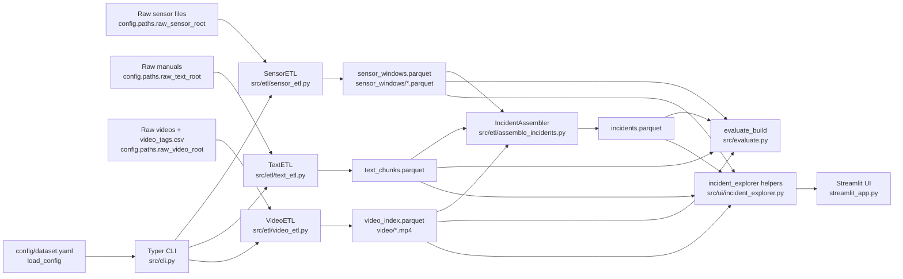
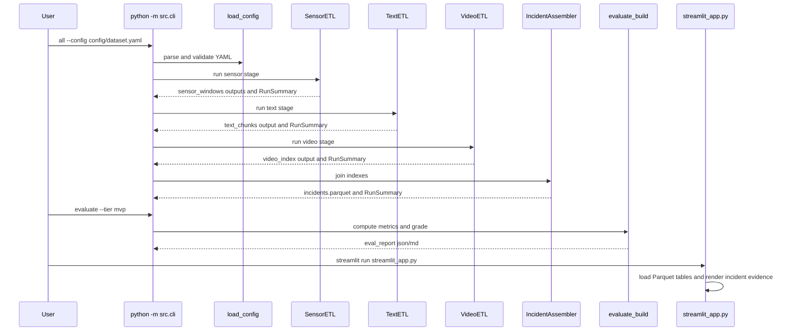
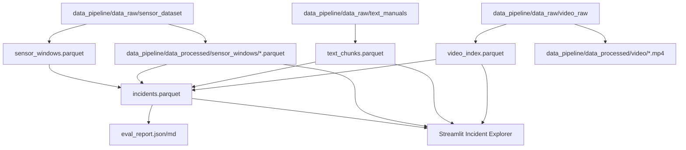

# Architecture Understanding

## Component Diagram

## Runtime Flow Diagram

## Data Flow Diagram

## Dependency Map

| Internal Area | Depends On | Evidence |
|---|---|---|
| `src/cli.py` | config, errors, ETL classes, evaluator, Typer | import lines in `src/cli.py` |
| `src/etl/sensor_etl.py` | config, errors, ids, IO, logging, schemas, pandas, numpy | import lines and class definitions |
| `src/etl/text_etl.py` | config, ids, IO, logging, schemas, optional tiktoken/docx/pypdf | imports and lazy imports |
| `src/etl/video_etl.py` | config, errors, ids, IO, logging, schemas, ffmpeg/ffprobe, optional cv2 | imports and `_INSTALL_HINT` |
| `src/etl/assemble_incidents.py` | config, IO, logging, schemas, pandas, numpy | imports and assembler classes |
| `src/evaluate.py` | config, IO, pandas | imports and metrics functions |
| `src/ui/incident_explorer.py` | IO helpers and pandas | imports and helper functions |
| `streamlit_app.py` | Streamlit and UI helpers | imports and `main()` |

## Module Responsibility Table

| Module | Inputs | Outputs | Responsibility |
|---|---|---|---|
| `SensorETL` | raw sensor files, sensor config | sensor index and window files | Normalize signals, estimate/use sample rate, detect events, carve windows |
| `TextETL` | PDF/DOCX/TXT/MD manuals | text chunk index | Read docs, chunk text, classify doc type, tag topics |
| `VideoETL` | MP4 files and tag CSV | video index and normalized clips | Probe video metadata, normalize when enabled, merge tags |
| `IncidentAssembler` | sensor/text/video indexes | incident index | Derive labels, match video, retrieve chunks, assign split |
| `evaluate_build` | generated indexes | report files and grade | Compute dataset coverage, integrity, and quality metrics |
| Streamlit UI | generated indexes and sensor/video files | browser interface | Display incident evidence and alignment summary |

## API and Interface Map

CLI interface from `python -m src.cli --help`:
- `sensor`: Run sensor ETL.
- `text`: Run text ETL.
- `video`: Run video ETL.
- `assemble`: Join indexes into `incidents.parquet`.
- `all`: Run sensor, text, video, assemble.
- `evaluate`: Compute quality metrics and grade.

Web interface:
- Streamlit app at `streamlit_app.py`.
- Verified local endpoint: `http://localhost:8501`, HTTP 200.

No REST API routes were found. This is an inference from source scan: there are no FastAPI/Flask dependencies and no route decorators in `src`.

## Storage Map

| Storage | Type | Evidence |
|---|---|---|
| `data_pipeline/data_raw/*` | local filesystem raw data | `config/dataset.yaml` path config |
| `data_pipeline/data_processed/*.parquet` | local Parquet contracts | config paths, processed artifact row counts |
| `data_pipeline/logs/*` | local logs | observed log files |
| Database | none found | dependency/config/source scan found no database driver/config |

## External Integration Map

| Integration | Usage | Evidence |
|---|---|---|
| ffmpeg/ffprobe | video metadata and normalization | `src/etl/video_etl.py`, `requirements.txt` note, `ffmpeg -version` passed |
| Streamlit | local UI server | `streamlit_app.py`, dependency list, HTTP check |
| GitHub Actions | CI | `.github/workflows/ci.yml` |

## Architecture/Code Mismatches

1. README status says "76 tests green, ~80% cov", but local current test run found `87 passed` and `82%` coverage.
   - Evidence: `README.md` status text; local `pytest -q --cov=src --cov-report=term-missing`.
   - Status: documentation drift.

2. `config/dataset.yaml` comments say the current defaults target staged 20-second CNC CSV runs, while memory from a nearby project mentions HDF5 in a different checkout. Current repo config enables `generic_csv` at `data_pipeline/data_raw/sensor_dataset`.
   - Evidence: `config/dataset.yaml`.
   - Status: current repo evidence wins; HDF5 memory is not applied to this checkout.

3. The `all --dry-run --limit 2` command timed out, while individual `sensor`, `video`, and `assemble` dry-runs passed and `text` dry-run timed out.
   - Evidence: command outputs in `00_execution_log.md`.
   - Status: text-stage performance or PDF parsing risk.

