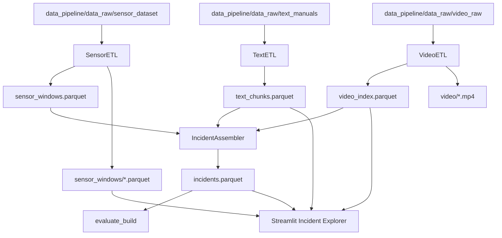
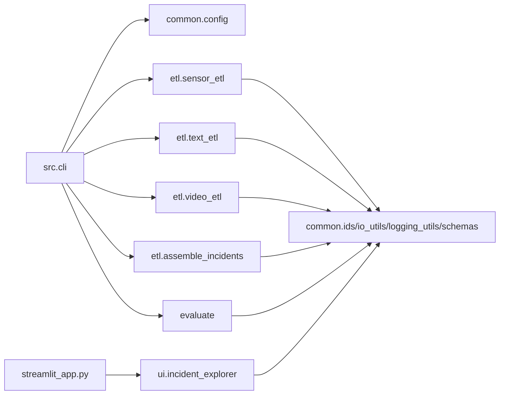

# Architecture

## High-Level Architecture

The repository is a local file-backed Python data pipeline with a Streamlit inspection UI.

Evidence:
- CLI: `src/cli.py`.
- ETL stages: `src/etl/sensor_etl.py`, `src/etl/text_etl.py`, `src/etl/video_etl.py`, `src/etl/assemble_incidents.py`.
- Shared contracts/utilities: `src/common/*`.
- Evaluation: `src/evaluate.py`.
- UI: `streamlit_app.py`, `src/ui/incident_explorer.py`.
- Configuration: `config/dataset.yaml`, `src/common/config.py`.

## Component Responsibilities

| Component | Responsibility | Evidence |
|---|---|---|
| Typer CLI | Orchestrates ETL, assembly, and evaluation commands | `src/cli.py`, `python -m src.cli --help` |
| Config layer | Loads and validates YAML into Pydantic models | `src/common/config.py` |
| Schema layer | Defines row contracts and enums | `src/common/schemas.py` |
| IO layer | Handles JSON-list serialization and Parquet IO | `src/common/io_utils.py` |
| Sensor ETL | Reads sensor runs, normalizes channels, detects/carves windows | `src/etl/sensor_etl.py` |
| Text ETL | Reads manuals, chunks text, tags topics | `src/etl/text_etl.py` |
| Video ETL | Probes/normalizes video and merges tags | `src/etl/video_etl.py` |
| Incident assembly | Links sensor, video, SOP chunks, maintenance chunks into incidents | `src/etl/assemble_incidents.py` |
| Evaluation | Computes dataset quality metrics and grade | `src/evaluate.py` |
| Streamlit UI | Displays incidents, vibration, video, text evidence, alignment, raw row | `streamlit_app.py`, `src/ui/incident_explorer.py` |

## Layered Architecture

1. Configuration layer: `config/dataset.yaml`, `src/common/config.py`.
2. Contract layer: `src/common/schemas.py`, `src/common/ids.py`, `src/common/io_utils.py`.
3. ETL layer: `src/etl/*`.
4. Assembly/evaluation layer: `src/etl/assemble_incidents.py`, `src/evaluate.py`.
5. UI layer: `src/ui/incident_explorer.py`, `streamlit_app.py`.
6. Validation layer: `tests/`, `.github/workflows/ci.yml`.

## Data Flow

## Module Interactions

## External Integrations

| Integration | Purpose | Evidence | Current Status |
|---|---|---|---|
| Streamlit | Local web UI | `streamlit_app.py`, `requirements.txt` | Running on port 8501 |
| ffmpeg/ffprobe | Video probing/normalization | `src/etl/video_etl.py`, `requirements.txt` note | Available; `ffmpeg -version` passes |
| GitHub Actions | CI | `.github/workflows/ci.yml` | Configured |

No database integration is implemented. Inference based on source/config/dependency scans and `docs/codebase_audit/08_grounding_matrix.md`.

## Configuration Architecture

`config/dataset.yaml` is the runtime configuration source. `src/common/config.py` validates it through Pydantic models:
- `PathsCfg`
- `SensorCfg`
- `VideoCfg`
- `TextCfg`
- `AssembleCfg`
- `RuntimeCfg`
- `PipelineConfig`

Path outputs include:
- `data_pipeline/data_processed/sensor_windows.parquet`
- `data_pipeline/data_processed/video_index.parquet`
- `data_pipeline/data_processed/text_chunks.parquet`
- `data_pipeline/data_processed/incidents.parquet`

## Deployment Architecture

Verified local deployment:
- CLI: `python -m src.cli ...`.
- UI: `python -m streamlit run streamlit_app.py --server.port 8501 --server.headless true --browser.gatherUsageStats false`.

CI deployment:
- `.github/workflows/ci.yml` runs on Ubuntu for Python 3.10, 3.11, 3.12, and 3.13, installs requirements, runs ruff advisory, and runs pytest with coverage.

Unknown:
- No production server, Dockerfile, docker-compose file, or cloud deployment target was found in the current source listing.

